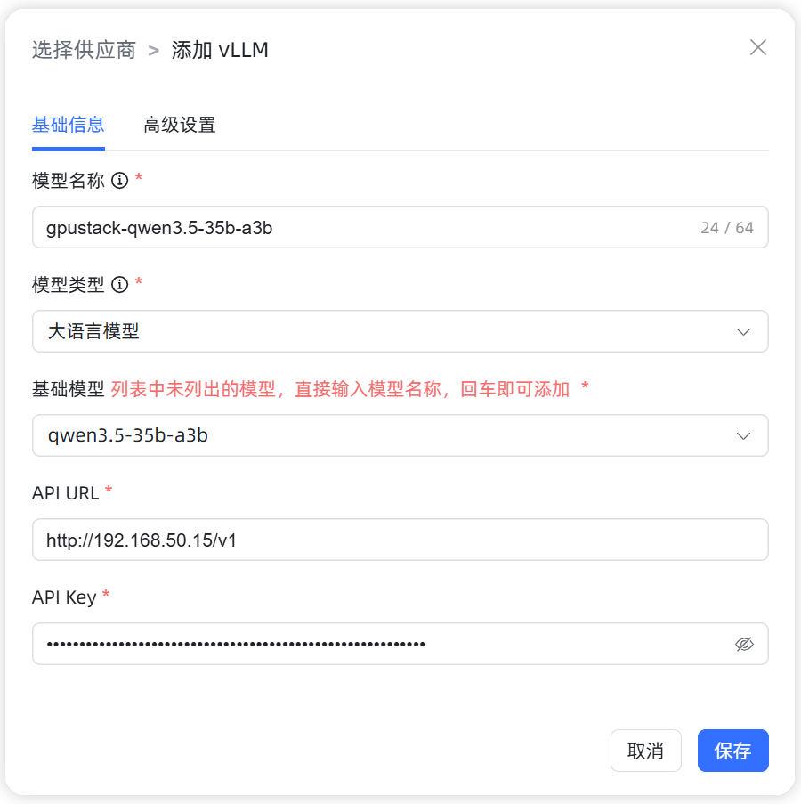
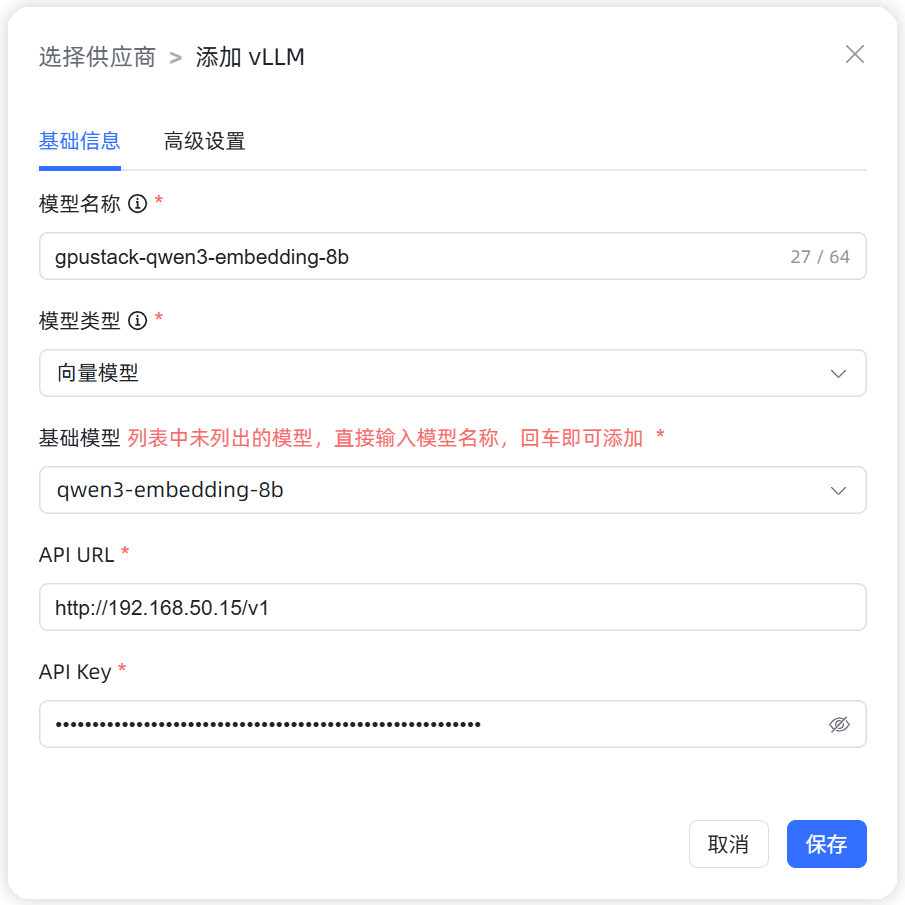
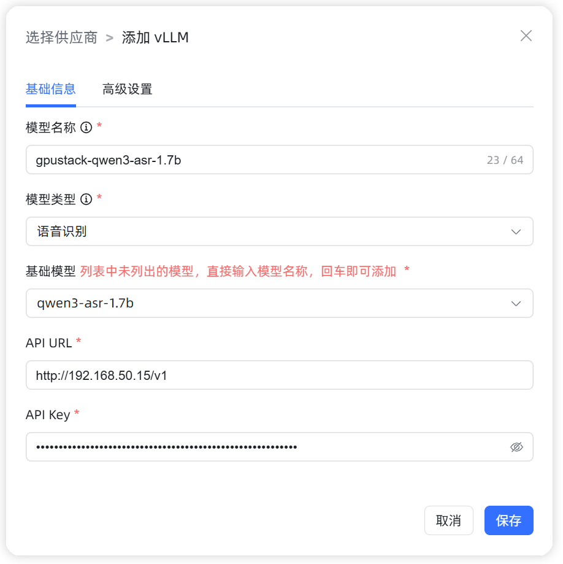
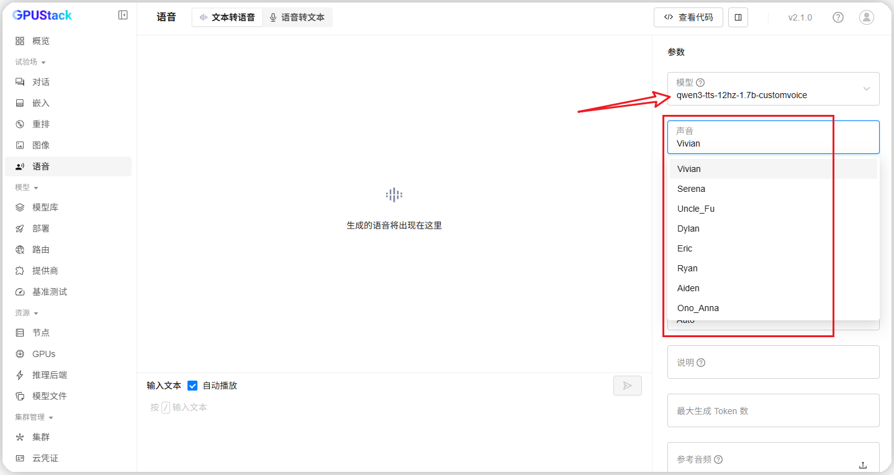
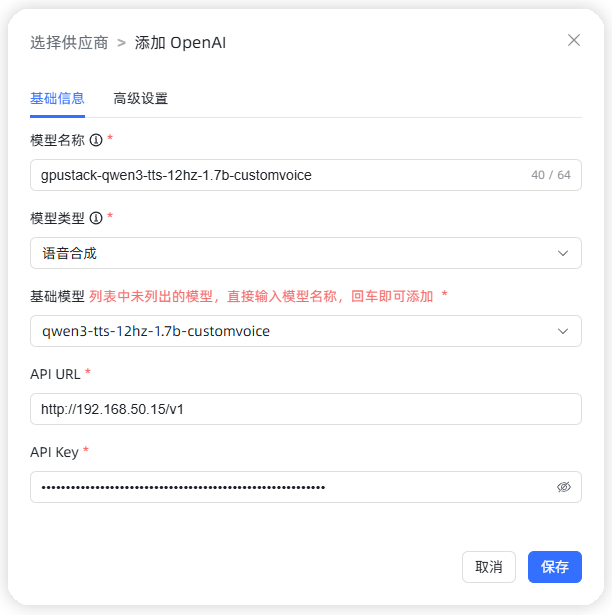
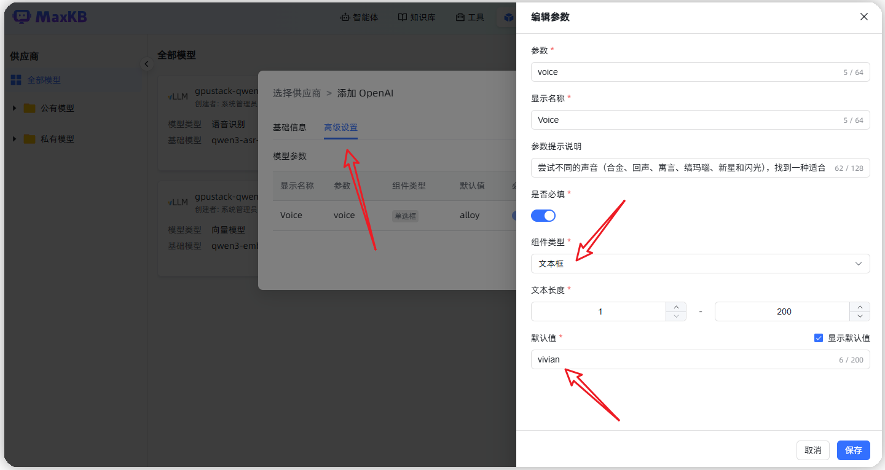
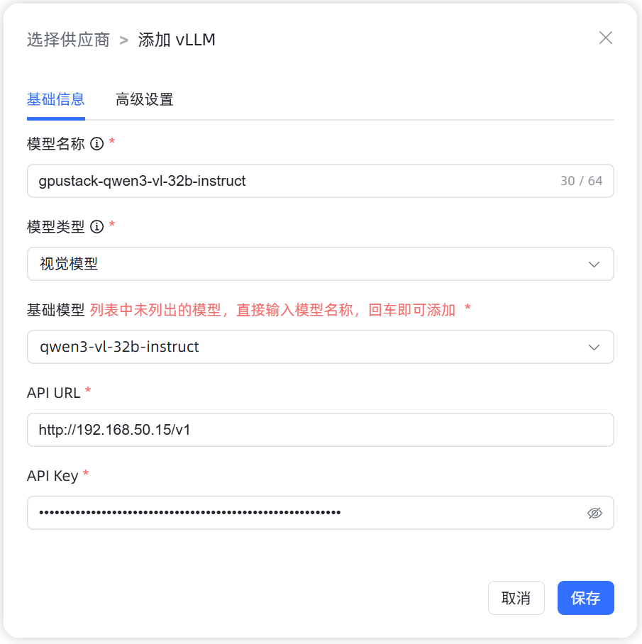
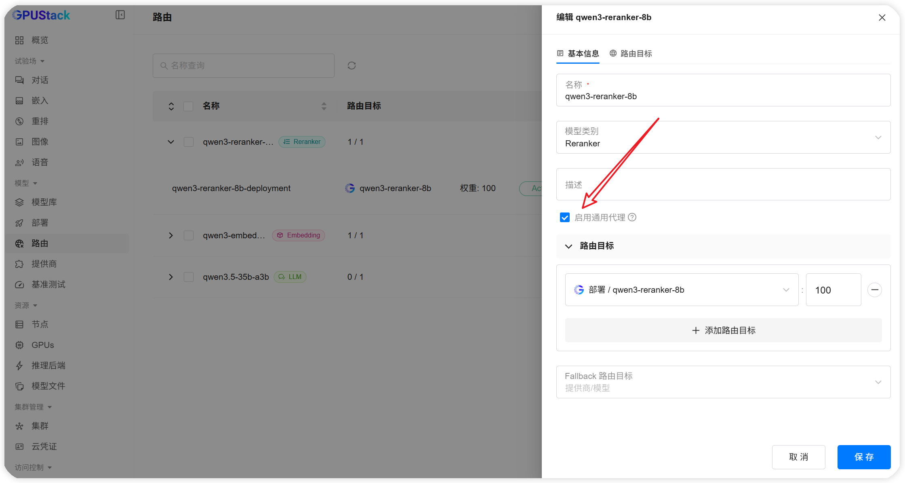
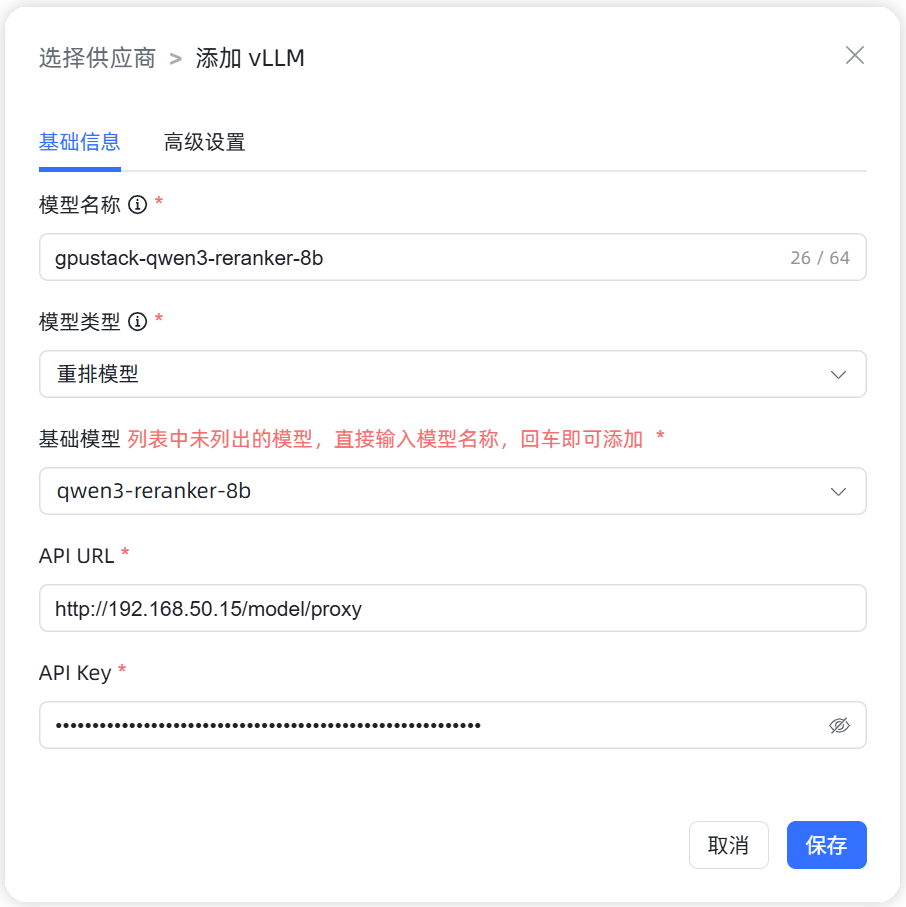

## 1 添加模型

!!! Abstract ""
    * 模型名称：MaxKB 中自定义的模型名称。
    * 模型类型：大语言模型/向量模型/语音识别模型/语音合成模型/视觉模型/重排模型，由 vLLM 和 OpenAI Provider 提供支持。   
    * 基础模型：不同类型模型下的基础模型名称，下拉选项是常用的一些基础模型名称，支持自定义输入。      
    * API 域名：GPUStack Web 地址， 如：http://192.168.50.15。 
    * API Key：在 GPUStack 中按照 UI 提示自行创建。

## 2 配置样例

!!! Abstract ""
    GPUStack-大语言模型配置样例图示如下：

{ width="500px" }

!!! Abstract ""
    GPUStack-向量模型配置样例图示如下：

{ width="500px" }

!!! Abstract ""
    GPUStack-语音识别模型配置样例图示如下：

{ width="500px" }

!!! Abstract ""
    GPUStack-语音合成模型配置样例图示如下（注意设置 Voice，Voices 来自 GPUStack Playground）：

{ width="500px" }

{ width="500px" }

{ width="500px" }

!!! Abstract ""
    GPUStack-视觉模型配置样例图示如下：

{ width="500px" }

!!! Abstract ""
    GPUStack-重排模型配置样例图示如下（需打开通用代理）：

{ width="500px" }

{ width="500px" }
